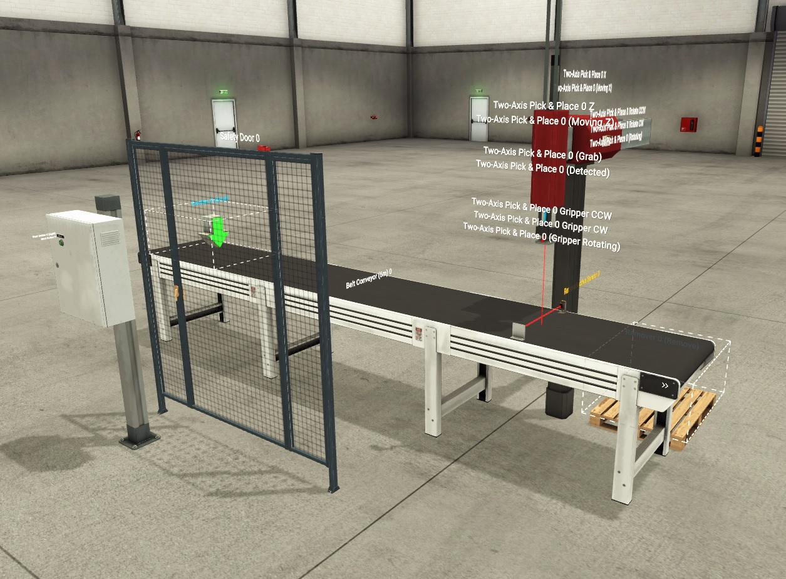
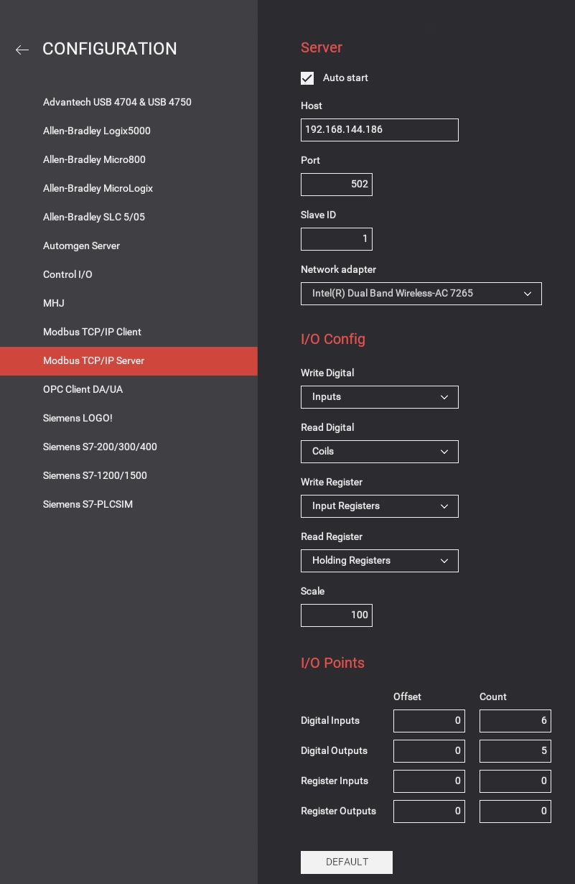
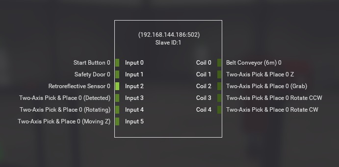
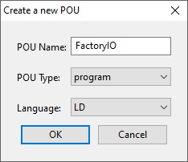
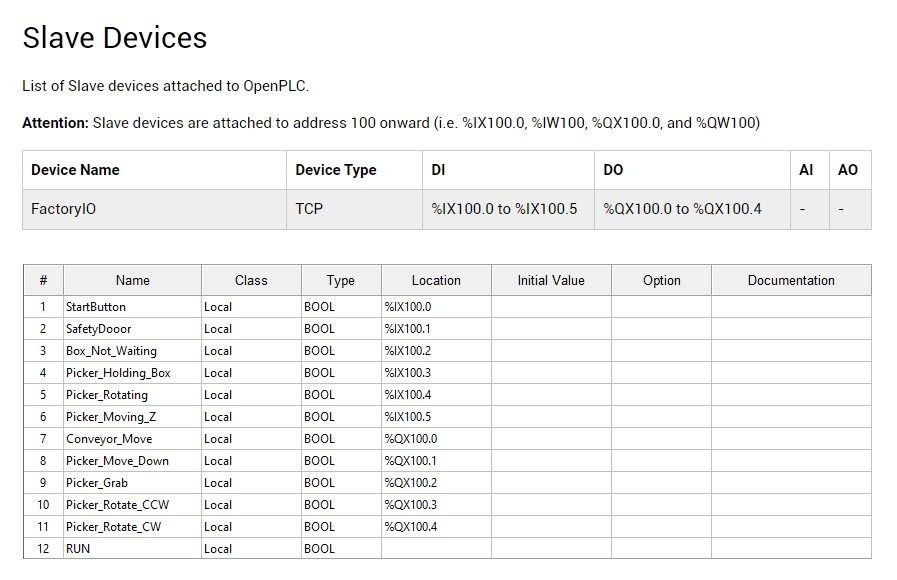
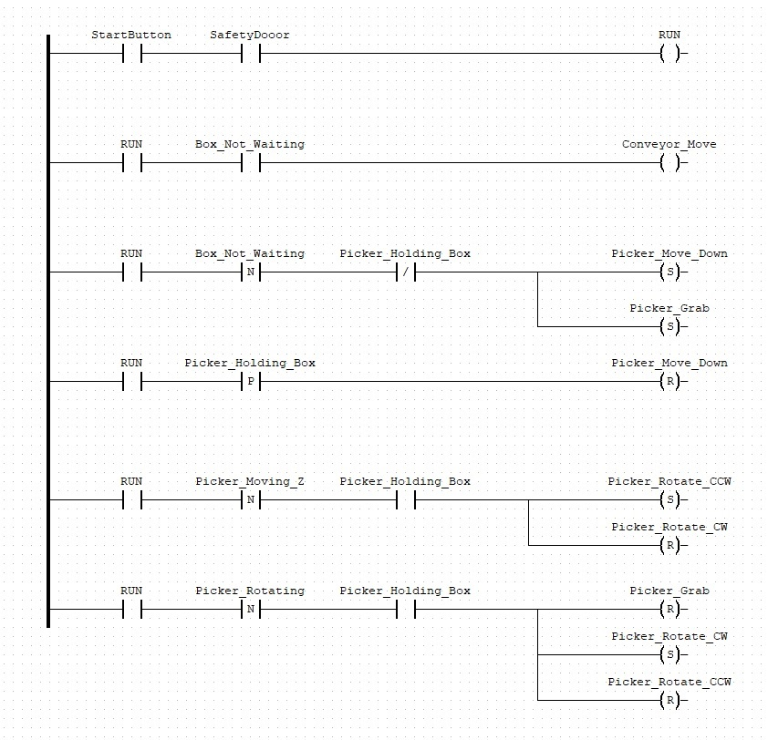
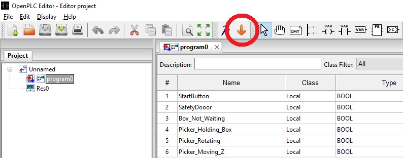
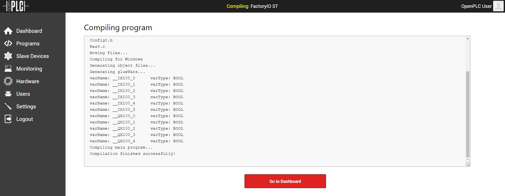
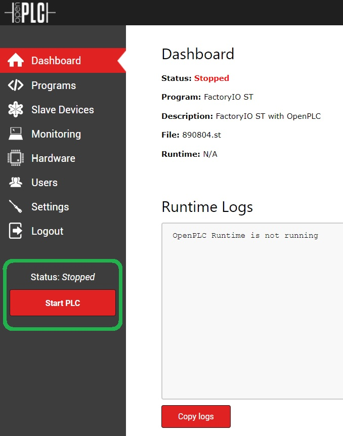
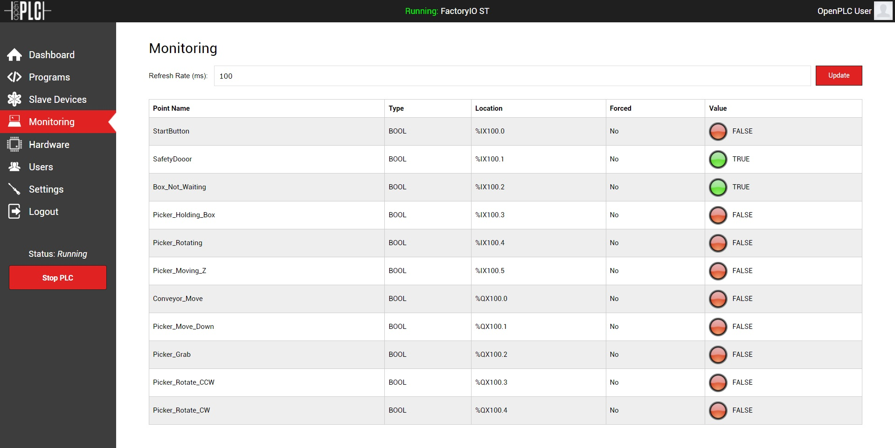

# OpenPLC and  FactoryIO tutorial
## Introduction
### Program versions
- FactoryIO version: v2.5.1
- OpenPLC Runtime version: 
- OpenPLC Editor version: 

This tutorial is a step-by-step introduction to OpenPLC and FactoryIO. 

- FactoryIO is a paid 3D Factory Simulation Engine for Windows. You can try it out for free with 30-days trial version.

- OpenPLC is an open-source [Programmable Logic Controller](https://en.wikipedia.org/wiki/Programmable_logic_controller) that is based on easy to use software. It consist of 3 projects:
     * <b>OpenPLC Editor</b> - is a software that lets you write PLC programs for the OpenPLC runtime. The programs are written according to the IEC 61131-3 standard. The editor is very simple to use and supports all five languages defined in the standard: Ladder Logic (LD), Function Block Diagram (FBD), Instruction List (IL), Structured Text (ST), and Sequential Function Chart (SFC)
     * <b>OpenPLC Runtime</b> - allows to run the project from OpenPLC Editor after exporting it to ``.st`` format
     * <b>HMI Builder</b>  as [Scada-LTS](https://github.com/SCADA-LTS/Scada-LTS) - an Open Source, web-based, multi-platform solution for building your own <i>Supervisory Control and Data Acquisiton</i> system. It allows you to create interactive screens, also called Human Machine Interface (HMI), for your automation projects

### Installation
For this tutorial you need:
- FactoryIO, OpenPLC Runtime and OpenPLC Editor
Version used in this tutorial are described in [program versions](#program-versions). 

Install FactoryIO from official [website](https://factoryio.com/), follow the instruction of the installer. 

Install OpenPLC Runtime from [this](https://www.openplcproject.com/runtime/windows/) website.
In this tutorial you need to be on Windows, so download the ``.exe`` setup, that will install Runtime and Editor.

## FactoryIO Scene
Open FactoryIO and create a new scene and start placing new objects.
I advice you to read a [documentation](https://docs.factoryio.com/getting-started/) to get a basic understanding of this program. There is also in-depth [manual](https://docs.factoryio.com/manual/) and a [description of all available parts](https://docs.factoryio.com/manual/parts/).

### Used parts
Here is a short description of parts that we will be using in this project
- [Emitter](https://docs.factoryio.com/manual/parts/emitter/) - a area in which new objects, like boxes are generated. It can be configured to spawn various box-sizes within specified time-frame
- [Belt Conveyor (6m)](https://docs.factoryio.com/manual/parts/light-load/#belt-conveyors) - moves the boxes from the creation point to the pick point
- [Start button](https://docs.factoryio.com/manual/parts/operators/#push-buttons) - used to start and stop the line. By default it is configured to ``Momentary Action``, so you need to have it pressed in order to 
- [Safety Door](https://docs.factoryio.com/manual/parts/walkways/#safety-door) - this door has a sensor that can detect when it is opened or closed. It limits access to the danger zone posed by the moving robot to factory personnel
- [Retroreflective Sensor](https://docs.factoryio.com/manual/parts/sensors/#retroreflective-sensor-and-reflector) - detects the light emitted by the element above in order to determine when a box is ready to be picked by the robot
     * Reflector - reflects light emmited by the ``Retroreflective Sensor``
- [Two-Axis Pick & Place](https://docs.factoryio.com/manual/parts/stations/#two-axis-pick-place) - picks the boxes and moves them out of the conveyor belt. Probably the most complex device on the scene, as it has a built-in set of sensors and actuators. However, this exercise only makes use of the following:
	 * Grab -  turns on the suction head to pick the boxes
     * Detected - detects if the suction head is making contact with any box
     * 1Z - extends/retracts the robot arm in the Z-axis
     * Moving Z - detects whether the robot is moving on the Z axis
     * Rotating - detects whether the arm (not the grabbing head) is rotating
     * Rotate CW - rotates the arm (not the grabbing head) clockwise
     * Rotate CCW - rotates the arm (not the grabbing head) counter-clockwise
- [Remover](https://docs.factoryio.com/manual/parts/remover/) -  object that will remove the boxes from the scene once they reach the end of the line

Visual parts - can be skipped. They're for visualization purposes:
- Pallet - a place for the boxes to fall
- Column + Electric Switchboard - a place where to place the start button

### Scene
After you placed all described objects you should have a static scene looking like this:

### Driver setup
Press ``F4`` key or go to ``File => Drivers `` to open driver menu. 
From the list of devices in top left corner, select ``Modbus TCP/IP Server``.

Now go to ``CONFIGURATION`` tab and configure ``I/O Points``:
- the simulation just uses 6 sensors, and 5 actuators (no registers), so we configure the values appropriately (6,5,0,0) and press back to do the final step. If you want to use more sensors or actuators, adjust this number accordingly.

If you want, you can also change ``Host``, ``Port`` and ``Network adapter``, but it's not needed.

Go back to driver tab, drag the sensors and the actuators to each one of the places in the driver, in a way that all of them have something assigned. 

You can save your scene and go to next step.

## Integrate OpenPLC with FactoryIO
Run ``OpenPLC Runtime`` and head over to ``localhost:8080`` adress in your browser.
Login with default credentials:
- login: openplc
- password: openplc
and go to ``Slave Devices`` tab.

Now we need to add and configure FactoryIO driver as a Slave Device for OpenPLC.
-   Device Type - must be generic Modbus TCP device
-   SlaveID - can be any number, but must coincide with the one previously configured in the driver for FactoryIO
-   IP Address - same address configured in the FactoryIO driver
-   IP Port - 502 is the default ModbusTCP port, it is recommended to keep it by default, even though it is possible to change it as long as it is the same in OpenPLC ad FactoryIO driver.
-   Discrete Inputs - starting at 0 and ending in the number of sensors (digital inputs) that we have (in our case 6)
-   Coils - starting at 0 and ending in the number of actuators (digital outputs) that we have (in our case 5)
-   Input Registers - there are no registers in this tutorial, so it can be configured as 0
-   Holding Registers – Read - there are no registers in this tutorial, so it can be configured as 0
-   Holding Registers -Write - there are no registers in this tutorial, so it can be configured as 0

## Programming in OpenPLC Editor
Now we need to create the control logic.
Open ``OpenPLC Editor`` and create a new project:

Select ``Ladder Logic``(LD) as a language.

Create new variables based on ``Slave Device`` configured in OpenPLC Runtime.
-   The variables declared in OpenPLC Editor must fall inside the range available by the Slave Device configured in the previous point
-   There is an auxiliary variable called ``RUN`` that will not be assigned to any input (%IX100.x) or output (%QX100.x)

With the variables already defined, it is possible to now proceed to develop the control logic, using for that purpose one of the standards in the sector ([Ladder Logic](https://en.wikipedia.org/wiki/Ladder_logic)). On a high level, the program will fulfill the following criteria:
-   Pressing ``StartButton`` starts or stops the line
-   Opening the Safety door will stop the line
-   The line stops when there is a box waiting
-   If there is a box waiting, the robot will start the suction hed, descend, rotate away from the conveyor belt, drop the box, and go back to its initial location

Now, create a ladder logic scheme based on the image below:

## Runtime
After creating a Ladder Logic in OpenPLC editor we need to export it to a ``.st`` file format, in order to comile it in OpenPLC Runtime. 

Now login to OpenPLC Runtime (default login and password: ``openplc``), and go to ``Programs`` tab. Here we need to upload exported file in ``.st`` format. After that, runtime should start compiling and after it's done, you should see this:

Now go back to ``Dashboard`` and there should appear a new button called ``Start PLC``:

Open FactoryIO with [previously](#factoryio -scene) created scene and launch it.

In OpenPLC Runtime click ``Start PLC`` and go to ``Monitoring Page``, you should see previously defined variable and a light indicators.

Now in FactoryIO, press start button and you should see the final result:
[here there will be GIF]

## References
- [Virtual Industrial Cybersecurity Lab](https://rodrigocantera.com/en/virtual-industrial-cybersecurity-lab-part-1-installation-and-configuration-of-pfsense/) with 4 parts
