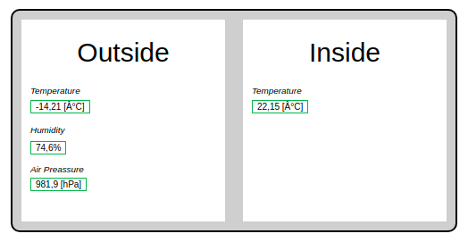

# Scada-LTS Tutorials - Home Scenario
 - SCADA-LTS Application version: **2.6.11**
 - Scenario file: [home project](./Scada-LTS-Home.zip)
 - Scenario version: **1.0.0**
 - Updated on: **31.01.2022**
 - Created by: **Radek Jajko**

This tutorial scenario is a step-by-step introduction to Scada-LTS. Each scenario will show how to configure 
this application depending on the given use case. Every time to specific tutorial we attach the 
ZIP file with the final configuration that can be imported into the Scada-LTS application. To do that just log 
in into the Scada and open the Import/Export page. Then find an upload section and import the following file.

## Included Scada content:
- Datasource creation
- Data points creation
- Point Hierarchy
- Data point details
- Point Event Detectors
- Event Handlers
- Users
- User Profiles
- Watch Lists
- Graphical Views

## Scenario content


## Home scenario
In this scenario we will try to show how to create a basic Scada configuration from starch using only
simple Virtual Data Points. Those data points will be presented on a graphical page that takes the advantage
of the HTML component to place that points inside a Weather Station schematic graphic. User will learn 
how to handle specific event and how to use it to modify the value of another data point. 

### Requirements
Before moving to the first configuration in application we need to know the requirements and the user story how
this application will be used. In this scenario we will be using Scada-LTS to display the current state of smart 
home devices. This scenario is focused on defining a basic Scada objects like "Data Points" and presenting 
them on a "Graphical View" and the "Watch List". So to achieve that in the most simple way we will be operating 
on the "Virtual Data Sources" that generates the random data based on the provided definitions. 

Moving back to the user requirements. We will have 3 different objects in our Smart-Home: 2x Weather Station 
and one Central Heating Boiler. One weather station will be located in a living room and the 
second will be placed next to user workshop in a garage. As a house owner we will have access to every 
device but our flatmates should have a possibility only to read the current measurements of Weather Station in a 
Living Room. We should present that living room measurements on a dedicated screen.

What is more we need to take some actions if the water in the Central Heating Boiler is too high. 
The alert should be displayed and the proper message about the boiler state should be visible.
Our boiler can show us the current water temperature and pressure. It has a panel that can display
a simple message to user and 3 different working modes: "OFF", "Auto Mode", "Manual Mode". User should be able to 
change that mode from the Scada application. 

### Data source configuration

Firstly to create a such configuration we should start from the most basic element of Scada-LTS application 
that is a Data Point. But to create a Data Point we must know the type of this object. We have a lot od different 
types of DataSources and each of it can be used to define a specific data point. In our case we just want to attach
the simulated data that was randomly generated. To do that we can use a **Virtual Data Source**. So to do it we can 
move to the Data Source configuration page .
Then using the select box in the top-right corner we can select a Virtual Data Source and click  add data source button. 

Then we can provide the following configuration: 

| parameter | value |
| --- | --- | 
| **name** | Weather Station - Room |
| **Export ID** | DS_WS_01 |
| **Update Period** | 1 minute |

The Export ID is a unique identifier that globally describe that object within whole application scope.
So make sure that this name is unique within your app. You can leave it as it was generated, but 
you can also provide your own naming convention for your business objects. It can be useful because sometimes
we need to know the object XID to attach it to specific component.

The update period for Virtual Data Source is a refresh time after which there is generated a new values in every 
data point that is defined within that object. Save that object and move now to the Data Point definition.

#### Data point definitions

After data source creation we can now create a Data Point within that entity. Our Weather Station device in this scenario
can handle the internal and external Temperature. It can measure the Air Pressure and the Humidity. What is more we can
get the information about the light strength. Each of this parameter should be treated as a separate Data Point object
with its own definition. To add that specific datapoint user should click on the  button.

The new section should be visible. So there is no other thing like creation of data points based on the following table:

|  | Point 1 | Point 2 | Point 3 | Point 4 | Point 5
| --- | --- | --- | --- | --- | ---
| **name** | Air Pressure | Humidity Inside | Light Sensor | Temperature Inside | Temperature Outside
| **Export ID** | DP_WS01_AIR_PRESS | DP_WS01_HUM_IN | DP_WS01_LS | DP_WS01_TEMP_IN | DP_WS01_TEMP_OUT
| **Settable** | True | True | True | True | True
| **Data type** | Numeric | Numeric | Numeric | Numeric | Numeric
| **Change type** | Brownian | Random | Random | Brownian | Brownian
| **Settings** | min=980 / max=1120 / change=10 | min=20 / max=100 | min=0 / max=1  | min=17 / max=23 / change=1 | min=-20 / max=35 / change=3
| **Start Value** | 1100 | 54 | 0 | 10 | 15

As you can see there are two different **"Change Types"**: Random and Brownian. Both are a kind of random generator 
methods but the Brownian remembers the previous value and the next one will be added to it form range that was defined
in a "change" field.


#### Copy configuration

Now we can copy our configuration to create another Weather Station. To do that we need to move back to the main 
DataSources page and click on the  button that is
placed in the "actions" section next to the "Weather Station - Room" entry.

Now the copy of data source has been created but the DataSource name and Export ID parameters are not correctly 
generated. To we have to fix that and replace the autogenerated ExportIDs with our pattern.

|  | Point 1 | Point 2 | Point 3 | Point 4 | Point 5
| --- | --- | --- | --- | --- | ---
| **name** | Air Pressure | Humidity Inside | Light Sensor | Temperature Inside | Temperature Outside
| **Export ID** | DP_WS02_AIR_PRESS | DP_WS02_HUM_IN | DP_WS02_LS | DP_WS02_TEMP_IN | DP_WS02_TEMP_OUT
| **Settable** | True | True | True | True | True
| **Data type** | Numeric | Numeric | Numeric | Numeric | Numeric
| **Change type** | Brownian | Random | Random | Brownian | Brownian
| **Settings** | min=980 / max=1120 / change=10 | min=20 / max=100 | min=0 / max=1  | min=17 / max=23 / change=1 | min=-20 / max=35 / change=3
| **Start Value** | 1100 | 54 | 0 | 10 | 15


#### Central heating data source

Final step is a creation of the third Data Source that will be representing our Central Heating Boiler device. 
We should repeat the previous steps with following configuration:

| parameter | value |
| --- | --- | 
| **name** | Central Heating |
| **Export ID** | DS_CH |
| **Update Period** | 10 seconds |

And then we can create a following data points:

|  | Point 1 | Point 2 | Point 3 | Point 4 | Point 5
| --- | --- | --- | --- | --- | ---
| **name** | Boiler Alert | Boiler Enabled | Boiler Mode | Boiler Pressure | Boiler Temperature
| **Export ID** | DS_CH_B_ALERT | DS_CH_B_STATE | DS_CH_B_MODE | DS_CH_B_PRESS | DS_CH_B_TEMP
| **Settable** | True | True | True | True | True
| **Data type** | Alphanumeric | Binary | Multistate | Numeric | Numeric
| **Change type** | No change | No change | No change | Brownian | Brownian
| **Settings** | - | - | - | min=0.5 / max=1.5 / change=0.3 | min=15 / max=150 / change=10
| **Start Value** | 'N/A' | 0 | 0 | 1 | 50

### Data Point properties

Now when we have data point definitions we can set up the rendering properties. To do that we
must open the specific data point details page. We can open it from two places. The first one is the 
watch list object, but we need to add datapoint to this list to move to the properties.
Second place is our "Data Sources page" . 
There we have to expand the specific Data Source using  arrows icon. 
Now we can see the DataPoint list with their description, status and action buttons. Using this
glass icon 
we can move to the DataPoint details. On that page user can find a details about this datapoint with
the value history table and chart and also with some additional statistics. Only from this place we can
move to the Data Point Properties page. To do that we must click on the  edit
button. Now we are on the proper page.

We will change the "Text renderer properties" to round the received value to one or two decimal
places depending on the datapoint. We should add also additional suffix to our measurements 
to know what kind of units we are using there. Try to provide a following configuration:

| Point | Type | Format | Suffix | 
| --- | --- | --- | --- |
| WS Air Pressure | Analog | #,##0.0 | [hPa] |
| WS Humidity | Analog | 0.0 | % |
| WS Temperature Inside | Analog | 0.00 | [°C] |
| WS Temperature Outside | Analog | 0.00 | [°C] |
| CH Boiler Enabled | Binary | Zero=Not working One=Working | - |
| CH Boiler Mode | Multistate | 0=Off 1=Auto Mode 2=Manual Mode | - |
| CH Boiler Temperature | Range | 0-30=Cold 31-60=Warm 61-100=Hot 101-200=Boiling! | Cold=blue Warm=green Hot=yellow Boiling=red |

Data points from Weather Station are simple "Analog Text Renderers" that just round the raw value
and display it with the specific suffix. Boiler data points are a bit different. We want to inform
user about the state in which it is working instead of displaying the raw numeric values. So for 
boiler mode that is a multistate point we can assign the following statements that key equal to 0
should be treated as "Off" state of this device. If this point reports the state equal to 1 we should
treat that as an "Auto Mode". And the last state is the "Manual Mode". It is very intuitive 
but this example was prepared to show the possibilities and the features of Scada.

### Data Point organization

Most of the configuration has been done. But we still need to create an objects that will
present the current values of selected data points. Before we do that we can organize our 
data points into separate directories to make our project clear. 

We should move to the "Point Hierarchy" page using this  
button on the navigation bar. Now in this page we see all DataPoint that we have just created in our 
application. Using the **"plus"** button we can create a new directory where we can just drag-and-drop
a specific Data Point. During this tutorial we will create a following structure:

- My Home
  - Heating
    - [Boiler Data Points] 
  - Devices
    - Weather Station 1
      - [Weather Station 1 points] 
    - Weather Station 2
      - [Weather Station 2 points]

This structure will be visible on the WatchList. 

### Creation of Watch List
Finally, we can move to the "WatchList page"  
using the navigation bar. On that page in the left section we can notice our Point Hierarchy structure with every data point. 
On the right there is a Watch List section that will be presenting the current values of points. 

As the first step we will change name of that list to the "Boiler" using this pencil button  next to the select box on the right. 
It is saved automatically, so we do not have to worry about changes. Next we have to add "Central Heating" data points to that list.
Using this Point Hierarchy section we can easily navigate to `My Home/Heating/` and add all points located in this place.
We can do that by clicking the "green arrow" next to the DataPoint name. After all the five data points should be visible on that list.

Moving forward we have to create another Watch List but this time to watch the "Living Room Measurements". To create a new one we have to
click on the "Add"  button
and set up the name to "Room". We can now add every data point from that Room Weather Station. And the same approach we can apply to 
"Garage". 

If Data Sources and Data Points are enabled here we will see the latest received values. When points are settable we can change the 
data point value manually using this wrench icon before the data point name. 

### Creation of Graphical View

Now we can move to the creation of our graphical data representation. In Graphical Views we can add a multiple
view components that can render out Point Values as simple fields or as graphic images. In this scenario we will take 
advantage of HTML and Simple Point Components to create a following Weather Station display.  



We will need to create a new Graphical View using the 
new Graphical Page button. Then in the "View Properties" we will set up the name and other parameters:

| Parameter  | Value | 
| --- | --- |
| Name | Room 1 - Living Room |
| Export ID | GV_R1 |
| Size | 1280x720 |

Now if we save that view we will have a blank page without any components. But to add some logic and layout to our page 
we will add two HTML components. This will be a tricky part where we create an HTML structure to define a Weather Station 
background graphic. Using this approach we can easily change the label names directly from a browser without a need of an 
external graphic program and all this process with uploading and replacing the old one element. Disadvantage of this solution
is an HTML and CSS knowledge requirement. So if you are not familiar with those concepts it might be difficult for you to 
create views using this approach. Do not worry there is also an option to upload a static images as background graphics. 

So add the first HTML component to the view and paste there the following statement:
```html
<div class="weather-station-container">
  <div class="ws-section">
    <h2>Outside</h2>
    <div class="ws-entry">
       <p>Temperature</p>
    </div>
    <div class="ws-entry">
       <p>Humidity</p>
    </div>
    <div class="ws-entry">
       <p>Air Preassure</p>
    </div>
  </div>
  <div class="ws-section">
    <h2>Inside</h2>
    <div class="ws-entry">
       <p>Temperature</p>
    </div>
  </div>
</div>
```

This will be our HTML structure of the Weather Station graphic. 
If we save that component we will not see anything special until we add the CSS styles to it. So create now 
a second HTML component and this will be our "style-base" component. 

```html
<style>
.weather-station-container{
  width: 500px;
    height: 250px;
    background-color: #cfcfcf;
    border: 2px solid;
    border-radius: 10px;
  display: flex;
}
.ws-section {
  width: 100%;
  display: flex;
  flex-direction: column;
  align-items: center;
  margin: 10px;
  background-color: white;
}
.ws-entry {
    width: 100%;
    padding: 10px;
    font-style: italic;
    font-size: 0.9em;
}
</style>
```
This will be simple HTML element that has a `script` tag inside with CSS class definitions. Those three classes
will update our Weather Station template, and it will look like on the picture. If you loose you component you can easily
find it using this "Iconify components" checkbox that is next to the "Add component button".

The final step is to add the Simple Point Components into our view to render point values. Again use the Component select-box 
and this time choose the "Simple Point" and click "add component". Move mouse over this component icon and click on the "Edit point
component settings"  button. 

Now set up the Point property and choose the valid point from the dropdown list. We need to add 4 data points so we need to create 
4 Simple Point Components in total. One will be for the Inside Temperature of Living Room and the rest will be the outside temperature,
humidity and air pressure. Every component on the graphical view can be moved using Drag-and-drop so user can easily manipulate over
that canvas. If he wants to arrange this points to the specific place we can do that using the "Position X" or "Position Y" parameters.

After save, we can see the working Graphical View example with simple Weather Station graphic. You can experiment with other 
graphical view components and check how they are working. 

### Creation of users and user permissions

When we have created all business objects in our application the last step is to create a user profiles and other users
to manage the permissions to specific objects. As we remember from the requirements we need to create a roommate user that 
will have only read access to the Living Room devices. 

To do that we will create a "User Profile". So open that page from the navigation bar .
Then click on the "Add button" next to the Manage user profile title and create a new profile with name: `Room Access`. In the section
below you can see all business objects that were defined in this application. From that list just find the Data Source with name: "Weather Station - Room"
and change the permissions to all data points inside that point to "read". So the user with this profile will have "read" access to that 
data points. Now set up also read access to "Room" watchlist and the "Room 1 - Living Room" graphical view.

When everything is ready we can create this profile.

After that we need to create a new user so move to the "Users page" . 
As in previous step click that "Add user" button next to the page sub-title and fill up this form with following properties:

| Property | Value |
| --- | --- |
| Username | roommate |
| Password | roommate |
| Email | mate@root.com |
| User Profile | Room Access |

As you can see in this place we are binding this `Room Access profile` to the specific user. Now after save we can check 
if the "roommate" user has limited access. To do that just logout and login using these credentials. 
As roommate user you should be able to see the Room watchlist with data points and Room graphical view with all components.

### Adding event triggers

We have created the general configuration where some user has full access to the system and other users are limited to specific
views and objects. But we can add some extra "intelligence" to our system that will be detecting the problems and users will be 
notified about them. Basically it is quite simple because we just need to create and event and then handle it in a specific way. 
But how to do that?

We need to move to the "Data Point properties" page of **Boiler Temperature** point (_see step [Data Point properties](#data-point-properties)_).
There is a section called: "Event detectors". Using this select box we can choose the "High limit detector" and add this event trigger
to this data point. We can set up its properties with following configuration:

| Parameter | Value |
| --- | --- |
| Export ID | PED_W_TEMP |
| Alarm Level | Critical |
| High Limit | 110 |
| Duration | 10 seconds |

Now when the value in this data point will be greater than "110" for longer than 10 seconds this detector will fire a new critical event.
This event will be visible on the "Alarm list" and in other places where the alarms may be visible like for example on the Watch Lists.
We need to remember about saving this changes using the save button below the left section settings.

The similar event trigger we can add to the "Boiler Mode" data point. Using this select box in top-right corner of the page we can easily
navigate to this point. This time we will create a "State detector" with following configuration:

| Parameter | Value |
| --- | --- |
| Alias | Manual Mode ON |
| Alarm Level | Information |
| State | 2 |
| Duration | 10 seconds |

This time the event will be fired if the "Boiler Mode" is in state equal to "2" for longer than "10 seconds". It should be only an
information event level because it is not a dangerous action.

### Adding event handlers

In this section we will present how to bind a specific action to the triggered event. To do that we need to move to the "Event Handlers"
section .
On this page we can see all created events and attached to them "Event Handlers". We will create two new handlers 
that will be changing the "Boiler Alert" message value depending on the Event State. So firstly we need to find our 
point event detectors. The first one with alias "Manual Mode ON" should be visible under the "Central Heating - Boiler Mode" point.
Click on that flag and fill up the form with following values:

| Parameter | Value |
| --- | --- |
| Type | Set point |
| Export ID | EH_BMM |
| Target | Central Heating - Boiler Alert |
| Active action | Set to static value |
| Value to set | Use with caution! |
| Inactive action | Set to static value |
| Value to set | Running in automode. |

Now after saving we will have a running Event Handler objects that will change the value of "Boiler Alert" data point depending
on the alarm state. That is ok, but we need also add another Event Handler this time for the second Event Detector.
So find the event detector within "Central Heating - Boiler Temperature" and set up a new handler with following values:

| Parameter | Value |
| --- | --- |
| Type | Set point |
| Export ID | EH_BTEM |
| Target | Central Heating - Boiler Alert |
| Active action | Set to static value |
| Value to set | Turn off! Boiler is overheating! |
| Inactive action | Set to static value |
| Value to set | Good morning! |

This time this event handler will change the value of the "Boiler Alert" data point to "Turn off..." when the 
water temperature is greater than 110 degree of Celsius. It might be a quite basic example, but we just want to present 
to you a possibilities that Scada-LTS have. 

### Summary

In the end we have a working Scada-LTS application configured to monitor and control the Home devices. When specific 
action takes place we are notified by the Alarm Event that the result is saved into the "Boiler Alert" point. This was the most 
basic Scada configuration tutorial which goal was to introduce to the basic application objects and relations between them. 
After this tutorial you should be able to configure a simple data flow in you application from receiving a data to presenting them
on a dedicated screen for only a specific user group. 