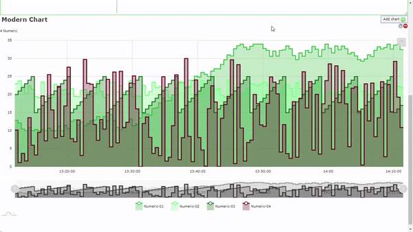
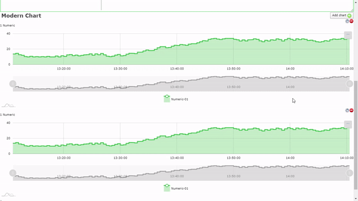

# Modern Charts Components

## September 2021 - Version 2.1.0
New version of the Scada-LTS modern charts components provide a new feature that
allows user to present Real-Time data on chart. That was achived by using 
WebSocket protocol and subscribing on a specific channel to receive a new value.

## June 2021 - Version 2.0.0

ScadaLTS modern charts components it is a set of new VueJS v2.0 components designed for GraphicalView in ScadaLTS. It is based on [am4chart](https://www.amcharts.com/) library. It generates charts using JavaScript from user-side which is a new approach to charts in Scada (they were generated via server-side scripts and libraries). It is more browser load than it was before, but server application becomes lighter and gains performance.

### June update

This update provide a brand new approach to Scada-LTS AmCharts. All JavaScript code
has been rewriten and redesinged to match the Design Patterns and improve the code
quality. For this reason there is much performance boost becouse the most memory consume methods has been removed. Charts now request a new PointValueAPI for data.
Chart definition has been also changed to much more flexible. 

## Types of charts:

- **\<line-chart>** Line Series Chart
- **\<range-chart>** Line Series Chart with Time-Range Selection

## Usage:

New charts could be added to ScadaLTS Graphical View by adding a new HTML component with specific content. Each chart has to be initialized by using this listed above Extended HTML Tags. Each of this tag take a specific properties required to set up specific chart. Chart is generated inside this tag which has default size 500x400px.

---

### Quick start:

Create simple line chart for specific [ numeric | multistate | binary ] data point.

```
<div id="chart-line-0" point-ids="[dataPointID]"/>
```

or

```
<div id="chart-line-0" point-ids="[dataPointExportID]" use-xid/>
```

That's it!\
It has rendered line chart for specific point from last hour with default parameters. So if you want to monitor the state of the point from last hour it is the simplest way how to do it. This chart could be zoomed in and out using scrollbar at the bottom of the component. Values of data point in time are represented by white dots on the chart.

But it is still just a chart like this old ones... What if we really want to monitor status of this point **in real-time**? No problem just add next properties.

---

### Live Data

```
<div id="chart-line-0" point-ids="[dataPointID]" refresh-rate="10000"/>
```

**Now we've got live chart!**\
It is refreshed every 10s (10000 ms) and when a data point will change state to different value this new one will be added to chart and the oldest one will be deleted from out chart. Now we can monitor state of datapoint in real-time with chosen by us refresh rate. For critical data, we can monitor the status of the point with a high frequency of queries to server (more real-time data but more resource consuming) and for non-critical data we can refresh chart after a few seconds.

There is also a possibility to monitor the state of the point in real-time using
web-socket connection. For more details see [WebSocket] section in the end of that file.

But what if we want to display chart for **multiple data points?**

---

### Multiple points

Just add next data point after comma in _'point-ids'_ property.

```
<div id="chart-line-0" point-ids="[dataPointID],[anotherDataPointID],[andNextDataPointID"],[fourthDataPointID"]/>
```


Now we have chart for 4 data points with values from last 1 hour. This components do not have limitations for a count of points displayed on the one chart, but I hope that you have an intuition that 30 point on a single chart is not a wise move.

Can we display **older values** than last one hour?

---

### Specified time period

Yes! Just add a new property to our tag.

```
<div id="chart-line-0" point-ids="[dataPointExportID]" refresh-rate="10000" start-date="1-day"/>
```

As you can see it's a piece of cake. Just type inside 'start-date' property, time period from which you want to see the data. You can use a every combination of numbers with specific time period **[ minute(s) | hour(s) | day(s) | weak(s) | month(s) | year(s) ]**. (eg. '2-days', '1-week', '3-months' etc.) But it is not everything! It is dynamic calculated time from now but we can also use a specific date. If we want see data from beginning of the previous year just type in date _(eg. '2019/02/01' to see data beginning from 1-st February 2019)_. It could be useful to limit displayed data.

To display values from specified period just add **'end-date'** parameter.

```
<div id="chart-line-0" point-ids="[dataPointExportID]" start-date="2019-02-01" end-date="2019-03-01"/>
```

And it still works with multiple data points. It's great! Isn't it? \

#### **Notice!**
Using `<range-chart>` there is no option to set up `start-date` and `end-date` parameter!

---

### Chart Colors

For example we have got 3 sensors. This default green colors are too similar. Can we set up a different color set for our charts. Just add this parameter:

```
<div id="chart-line-0" point-ids="[dpID],[dpID_2],[dpID_3]" color="#FFFC19,#0971B3,#B31212"/>
```

Now we have got defined 3 custom colors for our charts. We can give just a one color value and the rest will be retrieved from this default values. What is the most important... **USE HEXADECIMAL COLOR CODE VALUES**\
Pretty colorful Modern Charts. But we still have the same size for them... Yes, yes it also could be changed.

---

### Chart Size

```
<div id="chart-line-0" point-ids="[dpID]" width="1080" height="720"/>
```

HD Chart? Why not! Values for attributes are given in Pixels (px). That is useful when we have defined a multiple chart instances on one GraphicalView. We can easily calculate the position of the next chart.

---

### Multiple charts

To generate multiple charts on View page just use unique identifiers.

```
<div id="chart-line-0" point-ids="[dpID]"/>

<div id="chart-line-1" point-ids="[dpID]"/>

<div id="chart-line-2" point-ids="[dpID]"/>
```



### Aggregation
To increase the performance of the AmCharts there are two different approches. The first one is the build-in basic chart point aggregation. 
It limit the data displayed on the AmChart based on the **"aggregation"**
parameter provided with chart. This settings reduce the rendered data on
a user browser.

Second approach is related with Server-side aggregation. User can define the
data count limit using **"server-values-limit"** parameter. This settings
in ideal situation describe the amount of values that are distributed evenly on a timeline. But in real life some values are genereated at the same time or the gap between them can vary so the "ideal" situation with evenly distributed vales is almost imposible. So to fix that there is an **"server-limit-factor"** parameter that helps to achive the more reliable chart. Increasing that factor, we divide the interval into smaller blocks, so the data presenation is more accurate. There are more of this aggregated groups, but in each there are fewer values and averages to calculate.
If from specific range there are less values than **"server-values-limit"** define that mechanism will be disabled. It tries to get the most accurate graph. AmChart works well with less than 30 000 of data point values on a single chart, so try to set up your graph to not exceed that constraint. 

### **NEW FEATURE!!!** Chart Live Update via WebSocket
Scada-LTS supports WebSocket connection to receive data updates from the server
about the point value change. AmCharts can be configured to receive data updates
based on that event. To enable that feature, you need to add the following
parameter (**web-socket-enabled**) to the chart tag:
```
<div id="chart-line-0" point-ids="[dpID]" web-socket-enabled></div>
```
Remember that you should not use that property with **"refresh-rate"** that enable the same live update feature but based on the HTTP Requests. WebSocket immediately recieves the data updates so it is more efficient and faster. You are able to present
data in real time on the chart.

**Warning!**  
AmCharts may slow down for the huge amount of data so use this feature with caution.

## Modern Chart documentation:

Available properties in one place for all chart types. Charts could be exported to external file in graphical or text way. You can export to _.png, _.jpg, _.csv, _.json files.

Properties properties for Line charts

| Atribure name | Type | Example usage |
| --- | --- | --- |
| point-ids | String | point-ids="1,32,4" |
| use-xid | Boolean | use-xid |
| step-line | Boolean | step-line |
| start-date | String | start-date="2-hours" |
| end-date | String | end-date="2020-03-15" |
| refresh-rate | Number | refresh-rate="20000" |
| width | Number | width="1920" |
| height | Number | height="1080" |
| color | String | color="#FFFC19" |
| stroke-width | Number | stroke-width="3" |
| aggregation | Number (default=0) | aggregation="100" |
| separate-axes | Boolean | separate-axes |
| show-scrollbar | Boolean | show-scrollbar |
| show-legned | Boolean | show-legned |
| show-bullets | Boolean | show-bullets |
| show-export-menu | Boolean | show-export-menu |
| smooth-line | Number [0-1] | smooth-line="0.75" |
| server-values-limit | Number | server-values-limit="10000" |
| server-limit-factor | Number | server-limit-factor="1.5" |
| web-socket-enabled | Boolean | web-socket-enabled |
| show-controls | Boolean | show-controls |

# Author

- [Radosław Jajko](https://github.com/radek2s): **rjajko@softq.pl**

### Notes:

More image examples can be find here:

[Watch List Example Images](../../assets/doc/watch_list/)
