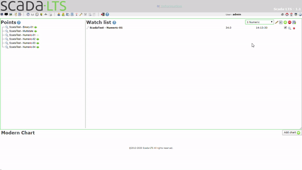

#Modern Watch List View
Created by _Radek Jajko_ [rjajko@softq.pl](mail:rjajko@softq.pl)

Modern Wach list is a new View for ScadaLTS prepared next to old classic WatchList page. It base on WachList 
data and genereate a Modern Charts using AmChart4 library.

##Example usage:
It is as simple as user expect. Just click __add chart__ and everything is ready!

Modern Chart is a vue.js component that can be placed in other views. On the Modern Watch List you can find 
settings button to modify chart behaviour. Complete guide how to use Modern Charts in Graphical Views you can find [here](../amcharts/readme.md)