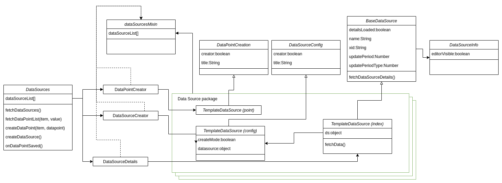

# Data Sources - Vue.js pages
DataSource creation is a complex task where there are many complex dependencies. To make further works easier we share a class relation diagram to be more aware where some actions are taken.

## Relations
Main View component is [DataSources.index.vue](./index.vue) file. It cointains main Vuetify table component that is rendered based on the dataSources array from Vuex store. Each entry is a separate DataSource instance. Each of them could be a different type of data source so to be able to render it this more advanced design was used. On the diagram below there is a map of vue.js component parent-child relations. Components that are marked with blue color are dynamic components that are rendered based on the data source type. The green ones are the generic overview where that components are located to not mess up the image.

There are 4 kind of dynamic components:
- **Base component (index.vue)**  
  This one is responsible for rendering the additionnal items that are related to specific data source type. For example SNMP data source has a tool to verify the OID numer so there that component is rendered.
- **DataSource Edit component (config.vue)**  
  Main part of creating and editing specific data source. This component should be composed from the base component 'DataSourceConfig.vue' becouse it provide some basic logic like form validation and so on. 
- **DataPoint List details (list.vue)**  
  Additional info that will be rendered on the Data Point List next to the datapoint name and status.
  
- **DataPoint Edit component (point.vue)**  
  Second important component. This one is responsible for creation of DataPoints.
  In many cases it will be a complex form with many fields that are required to define a datapoint.

[Here](../../components/datasources/README.md) you can find the instruction how to create them.

## Code Diagram

@author: Radoslaw Jajko